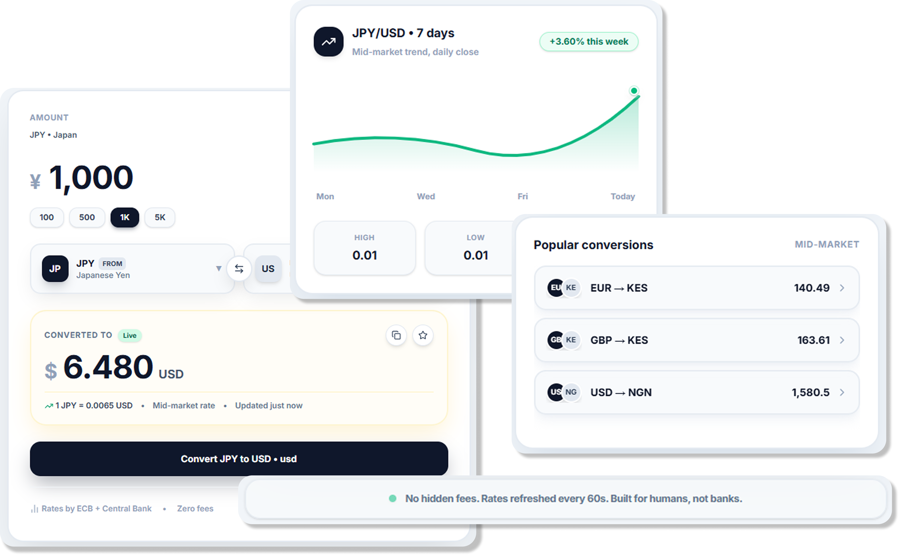

# Flux



🔗 **Live Demo:** [https://flux-currency.vercel.app/]

## Overview
**Flux Currency** is an advanced, high-performance currency conversion and market analytics web application engineered to empower travelers, freelancers, digital nomads, and global merchants. It provides real-time mid-market rates, historical trend graphs, and high-frequency rate updates through an elegant, modern interface.

---

## Key Features
* **Real-Time Currency Conversions:** Instant calculations backed by live mid-market rates via ExchangeRate-API.
* **Interactive Trend Analysis:** Dynamic 7-day daily close trend tracking with high, low, and volatility indicators.
* **Quick Amount Presets:** One-tap selection buttons for frequent cash amounts ($100, $500, $1K, $5K).
* **Popular Conversions Panel:** Live tracking widgets for high-volume currency pairs (EUR/USD, GBP/USD, USD/KES).
* **Zero-Fee Transparency:** Clear indication of mid-market rates with no hidden fees or banking markups.
* **Smooth Animations:** Fluid component transitions powered by Framer Motion.
* **Fully Responsive Design:** Crafted for seamless viewing across mobile, tablet, and desktop devices.

---

## Target Audience
* **Tourists & Travelers:** Quickly calculate local prices and understand actual conversion rates abroad.
* **Freelancers & Remote Contractors:** Track foreign currency payouts and fluctuating monthly earnings.
* **Digital Nomads:** Manage multi-currency budgeting and fluctuating cost-of-living expenses across borders.
* **E-commerce Merchants & Dropshippers:** Handle overseas supplier costs and international customer price quoting.
* **Online Shoppers:** Check true conversion totals before purchasing from global retailers.

---

## Tech Stack
* **Frontend Library:** React + Vite (JavaScript)
* **Styling:** Custom CSS / Modern Tailwind-inspired utility classes
* **Animations:** Framer Motion
* **Icons & Assets:** Lucide React Icons
* **API Integration:** ExchangeRate-API

---

## Project Structure

```text
flux-currency/
├── public/
│   ├── preview.PNG
│   └── favicon.ico
├── src/
│   ├── assets/
│   ├── components/
│   │   ├── Navbar.jsx
│   │   ├── CurrencyConverter.jsx
│   │   ├── MarketChart.jsx
│   │   ├── PopularConversions.jsx
│   │   └── Footer.jsx
│   ├── App.css
│   ├── App.jsx
│   ├── index.css
│   └── main.jsx
├── index.html
├── package.json
└── vite.config.js